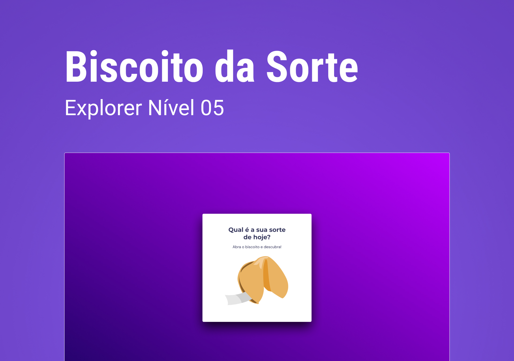

<h1 align="center">
    Biscoito da Sorte
</h1>

Desafio Stage 5 | Curso Explorer

💻 Projeto

O Biscoito da sorte é um um site com frases desmotivacionais para alegrar o seu dia.

🚀 Tecnologias 

Esse projeto foi desenvolvido com as seguintes tecnologias:

<ul>
<li>HTML e CSS</li>
<li>JavaScript</li>
<li>Git e Github</li>
<li>Figma</li>
</ul>

📝 Licença

Esse projeto está sob a licença MIT.

